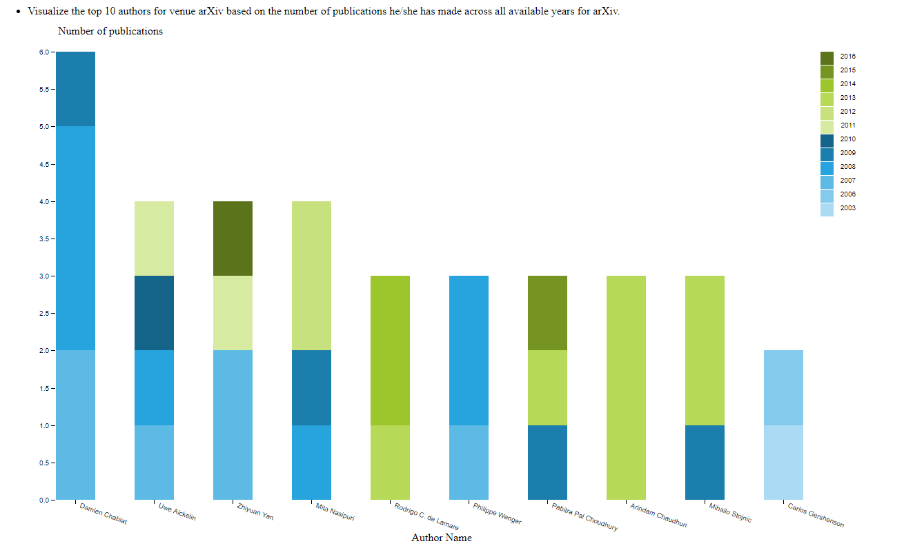
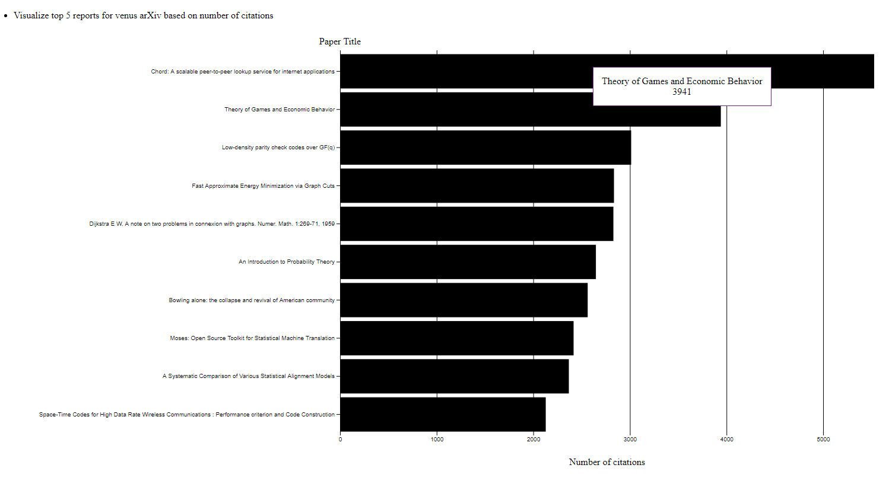

# 1. Introduction 
- The objective of the assignment is to visualize for thousands of scientific documents to digest a big source of text or even making out meaningful insights from the data is challenging.
- Three main area of user behavoir is analyzed and visualized.
    1. Visualize the top 10 authors for venue arXiv based on the number of publications he/she has made across all available years for arXiv.
    2. Visualize the top 5 papers for venue arXiv based on the number of citations across all available years for arXiv. (how many times this paper has been cited, so consider those with the largest inCitations from arXiv)
    3. Visualize the trend of the amount of publications across all available years for venue ICSE.
## Contributions
- Contributors of this project are:
    1. Yumeng Yin(E0227600)
    2. Shwe Soe Chun (E0210469)
- Task and responsibility allocation
    - Yumeng act as the main visualizer for Q1.
    - Soe Chun act as the main visualizer for Q2.
    - Q3 was done together.
    - Overall, github is used to host our code.  The code can be found [here](https://github.com/soechun/cirviz)

# 2. Visualization Purpose & Method
| Objective | Visualization |
| :-------: | :-----------: |
| 1 | Stacked bar chart |
| 2 | Bar chart |
| 3 | Line chart with trend line |

## 1. Top 10 authors for venue arXiv based on the number of publications he/she has made across all available years for arXiv.

### Method
1. Since the task is to visualize the top 10 authors for venue arXiv based on the number of publications. To retrive the data, we first filter out all data for venue arXiv. After that, the count of each author (distinguish author using ID) for each year are calculated. Total counts of all publications for all year for authors are calculated to get the ranking and retrive the top 10 authors' data.
2. From step 1, we now have the csv file which contain the top 10 authors and there count of publications for each year.
3. For each author we draw a stacked bar, we use different color to denote publication number for different year.

### Justification for visualization 
- To show the total ranking for those authors and to visualize the change of the publications among all years we select to use stacked bar chart. 

### Insight
From the final chart, we can find out that Damien Chablat is the top 1 from all of the publications in previous few years and he actively publish paper on arVix before 2010.
    
## 2. Visualize the top 5 papers for venue arXiv based on the number of citations across all available years for arXiv. (how many times this paper has been cited, so consider those with the largest inCitations from arXiv)

### Method
    1. The Task is to visualize the top 5 papers for venuse arXiv.  First, we used jupyter and python for dataprocessing.
    2. Using pandas, we were able to extract out the data rows that has the venue ArXiv. We used the panda to get the lenght of the inCitations for each report and append it as column.
    3. We use that column to sort and get the top 5 papers from the list. 
    4. We use the bar chart to plot them using d3.  title as y axis and inCitations number as x-axis.
### Justification for visualization 
- For this plot, it is a straight forward choice likewise with the first graph, we are comparing the number of inCitations with the title.  So we can safely use the barchar and a tooltip to show what are the top reports that are most cited in venue "ArXiv".
### Insight
- From the graph it can be seen that, the top 10 has at least 2000 inCitations and the highest paper has over 5000 incitations which is impressive. And by looking at the data, it can be seen that most of the papers are about Computing and Mathematics meaning there are a lot of papers on these topics. 

## 3. Visualize the trend of the amount of publications across all available years for venue ICSE.

### Method
    1. This task is to get the trend line on how papers with venue ICSE are being published and statistics throughout 1992. We first filter out the papers that has venue ICSE.
    2. The data is then further processed to get only years and title as these are the only applicable fields.
    3. The data is then groupedby year and aggregator function is used to get the count of papers for each year.
    4. To visualize we use year as x_axis and use number of papers as y_axis, after that line chart is plot to show the change of number of papers among all years. 
    5. Last but not least, the trend line is calculated using formula. To get the trend line, we pass all data entry to the function leastSquares and this function will calculate the returns slope, intercept and r-square of the line and return back. After that, the line is drawn using the equation.
### Justification for visualization 
- We found out that there is only countable number of repositories under torvals.  So, It is easier to compare languages across different repositoires. As we used a grouped barchart, it is also easier to compare which language is the most dominant in each repository.  We also used log scale on the Y axis as one of the repository (linux) is a very popular repository with a large number of C code written in it.  So without log scale, we won't be able to comprehend the difference between the rest of the repositories.

### Insight
From the line chart we can see that the trend of the number of papers published is increasing in the previous years. However, the increase is not stable, the number can be even zero for some year.